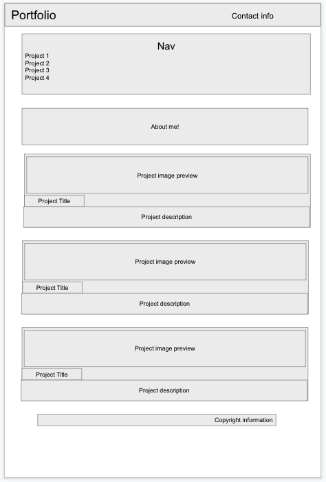

# portfolio

A small smattering of a portfolio!

  

This portfolio is also a showcase in itself of what can be done
It is written just in HTML and CSS on its own but will occasionally be updated
as I update my skills.

## Wireframe

There are two wireframes used for this project one for the desktop version and 
the other for the mobile version. Both were made using google slides.

Desktop wireframe:

Mobile wireframe

## Credits
## Copyright 

 This work is licensed under a <a rel="license" href="http://creativecommons.org/licenses/by-sa/4.0/">Creative Commons Attribution-ShareAlike 4.0 International License</a>.

This means you can share it, and distribute it as much as you like but you must credit me and keep the same license
